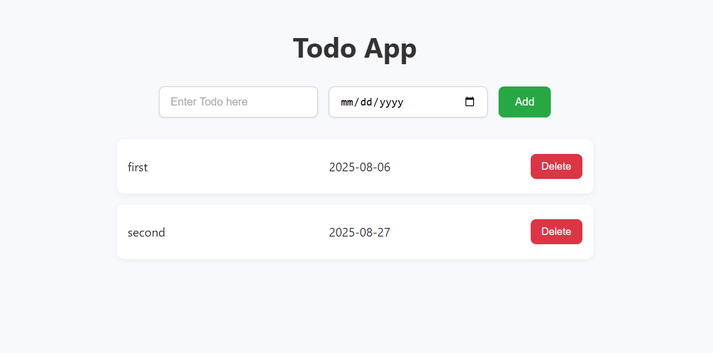

# ✅ Todo App

A simple and elegant Todo List web application built using **HTML**, **CSS**, and **JavaScript**.

This app allows users to:
- Add tasks with a due date
- View and manage their task list
- Delete tasks once completed

 

## 🚀 Live Demo

> [🔗 Click here to view the demo](#https://abhishekborad001.github.io/To-do-list-project/)  

 

## 🖼️ Preview

  

 

## 🛠️ Features

- 📝 Add tasks with a description and due date
- ✅ View a clean and responsive list of tasks
- 🗑️ Delete individual tasks
- ✨ Clean and modern UI with responsive design

 

## 🧰 Technologies Used

- **HTML5** – Structure of the app
- **CSS3** – Styling and responsive layout
- **JavaScript (Vanilla)** – Logic for adding, displaying, and deleting todos

